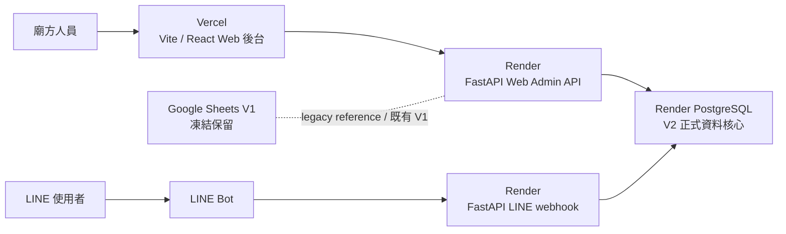

# 0.8.0A-10 Web 後台技術架構路線圖

本文件記錄 `0.8.0A-10 Vercel Frontend + Render Backend Web Admin Architecture Roadmap`。

本輪只做文件規劃，不代表已建立正式前端、不代表已啟用 PostgreSQL、不代表已部署。

## 1. 文件目的

本文件用來規劃桃園中原福德宮 Web 後台 V2 的正式技術方向，讓後續 Codex 任務、人工 review 與第三方協作能以相同架構前提接續。

本文件不做：

- 不修改 `web_admin_mvp/` prototype。
- 不建立 `web_admin_app/`。
- 不修改 Render FastAPI。
- 不修改 LINE Bot runtime。
- 不修改 Google Sheets。
- 不部署。

## 2. A10 決策摘要

已決定：

```text
V1 凍結保留
V2 正式開發
Google Sheets 不再作為 V2 設計前提
LINE Bot 未來重新整合
AppSheet 不再擴充為 V2 核心
正式技術架構方向：Vercel + Render
```

V1 = Google Sheets + Render FastAPI + LINE Bot。

V2 = Web 後台正式系統 + 正確資料模型 + 權限設計 + API + PostgreSQL + 未來 LINE Bot 整合。

## 3. V1 / V2 邊界

### V1

V1 保留既有功能，除非現有功能故障，否則不再修改。

V1 不再：

- 新增功能。
- 擴充 Google Sheets。
- 追隨 Web 後台 V2 prototype 改動。
- 作為 V2 的資料模型限制。

### V2

V2 正式進入 Web 後台架構與開發階段。

V2 後續設計以前端、API、權限、資料模型與新資料核心為主，不再把現有 Google Sheets 欄位限制當作設計前提。

## 4. Vercel + Render 架構圖



## 5. 責任分工

### Vercel

- Vite / React Web Admin。
- 廟方人員操作介面。
- 手機與桌面導覽。
- 表單、列表、詳情頁與權限顯示。
- 呼叫 Render API。
- 不直接連資料庫。

### Render

- FastAPI。
- Web Admin API。
- LINE Bot webhook。
- 權限檢查。
- 商業邏輯。
- PostgreSQL 存取。
- audit log 與資料安全邊界。

### Render PostgreSQL

- V2 正式資料核心候選。
- 不再受 Google Sheets 欄位限制。
- 承載善信、廟務、帳務、採購、公文、權限、操作紀錄等正式資料。

### Google Sheets V1

- 只保留現有 LINE Bot MVP。
- 不再作為 V2 設計前提。
- 不再擴充新模組。
- 不再追隨 Web 後台 prototype。

## 6. `web_admin_mvp/` 與未來 `web_admin_app/`

### `web_admin_mvp/`

定位：

- UX prototype。
- 流程參考。
- 模組討論參考。
- 第三方測試參考。

不得直接硬接正式資料庫。

### 未來 `web_admin_app/`

定位：

- 正式 Web 後台前端。
- 建議使用 Vite / React / TypeScript。
- 部署方向為 Vercel。
- 透過 API 與 Render FastAPI 溝通。

本輪不建立 `web_admin_app/`。

`0.8.0A-11` 補充：`web_admin_app/` 建立前需先完成 skeleton setup plan，確認資料夾位置、技術選型、初期 routes、權限 placeholder、API 串接節奏與 Vercel 部署邊界。A11 只做文件，不建立正式前端。

`0.8.0A-12R` 補充：A12 的 Next.js skeleton 嘗試在 Windows 本機 build 驗證中受 Next.js / webpack / EISDIR readlink 問題阻塞。MVP 前端技術方向調整為 Vite + React + TypeScript；Vercel + Render 架構、Render FastAPI / PostgreSQL / LINE Bot 未來整合方向不變。

## 7. Render FastAPI 後端未來目錄方向

未來候選方向，非本輪實作：

```text
app/
  main.py
  routes/
    line_webhook.py
    admin_auth.py
    devotees.py
    temple_affairs.py
    ledger.py
    shrines.py
    visits.py
    announcements.py
    events.py
    procurements.py
    documents.py
  services/
  repositories/
  models/
```

V1 runtime 目前不改。若未來建立 V2 API，應避免與現有 V1 route 混用。

## 8. Render PostgreSQL 未來資料表方向

未來候選，不代表本輪建立：

```text
users / profiles
team_members
devotees
temple_affairs
ledger_categories
ledger_entries
shrines
visits
announcements
events
procurements
documents
document_files
audit_logs
line_query_logs
```

實際資料表需另開資料模型階段確認。

## 9. 不一次做完所有模組的原因

Web 後台 V2 範圍已涵蓋善信、廟務、友宮、來訪、公告、活動、團隊、帳務、採購、公文、權限與未來 LINE Bot。一次開發所有模組會造成：

- 權限邊界不清。
- API contract 不穩。
- 資料模型過早固定。
- UX 流程難以驗證。
- 測試與 rollback 成本過高。

因此應分階段建立基礎架構，再逐步擴充模組。

## 10. 第一階段開發優先順序

建議第一階段：

```text
Milestone 1：Web Admin Foundation
- 正式前端專案骨架
- 登入後主控台骨架
- 側邊 / 手機導覽骨架
- 模組入口
- 權限顯示規則草案
- mock API 或 API contract
- 不處理完整 CRUD
```

第二階段再進入基礎模組的列表、詳情、表單與 API 串接。

## 11. 風險與防護原則

- 不讓 V2 直接修改 V1 Google Sheets。
- 不在 V2 未穩定前改現有 LINE Bot。
- 不讓前端直接連 PostgreSQL。
- 不把 sensitive data 開放給 LINE Bot 查詢。
- 不把 prototype 視為正式系統。
- 不跳過權限、audit log 與資料模型設計。
- 不在沒有 rollback 計畫時動正式 webhook。

## 12. 本輪不做

- 不建立正式 Vite 專案。
- 不建立 `web_admin_app/`。
- 不修改 `web_admin_mvp/`。
- 不修改 Render。
- 不修改 LINE Bot。
- 不修改 Google Sheets。
- 不新增環境變數。
- 不部署。
- 不 commit。
